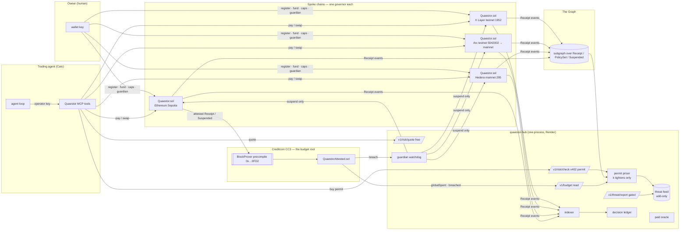
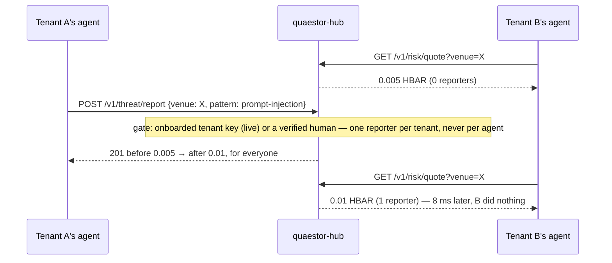
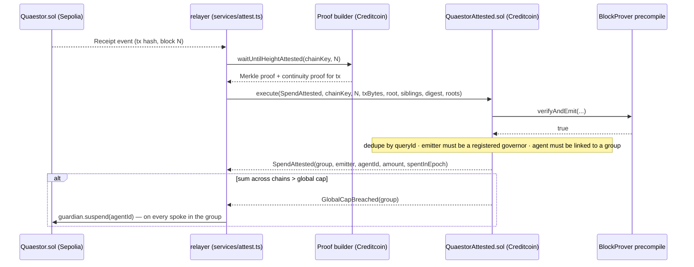

# Quaestor — architecture

Quaestor is one governed endpoint for trading agents, on any chain. This document is the
map: what runs where, which chain enforces what, and how one agent's mistake protects
every other tenant.

## 1. The system



Three layers, three different guarantees, each named honestly:

| Layer | Where | Guarantee |
|---|---|---|
| **Per-chain budget** | `Quaestor.sol` on each spoke | Hard and atomic. `_authorize` checks and increments in one transaction; cannot be raced. Per-category, per-epoch and per-call caps. |
| **Cross-chain budget** | `QuaestorAttested.sol` on Creditcoin | Trustless aggregation. Spends are *proven* through the Attestcoin precompile, not reported; one global cap per agent group across chains. Eventually consistent (attestation latency), so it is the ceiling, not the wall. |
| **Route pricing** | the hub | Economic, multi-tenant. A venue's permit costs `base × (1 + k · distinctReporters)`. The hub never refuses; when the premium exceeds the owner's per-call cap, the *spoke chain* refuses. |

## 2. One agent, one trade

```mermaid
sequenceDiagram
  participant Cato as Agent (Cato)
  participant Hub as quaestor-hub
  participant Gov as Quaestor.sol (Arc)
  participant Venue as Venue (DEX)
  Cato->>Hub: GET /v1/risk/quote?venue=X
  Hub-->>Cato: permit = 0.005 × (1 + k·reporters(X))
  Cato->>Gov: pay(agentId, INFERENCE, hub, permitPrice, metaHash)
  Note over Gov: per-call cap check — reverts PerCallCapExceeded if the herd priced X out
  Gov-->>Cato: Receipt(agentId, INFERENCE, hub, amount, metaHash, epoch, spentAfter)
  Cato->>Hub: GET /v1/risk/check?venue=X  (x-quaestor-tx: receipt)
  Hub-->>Cato: verdict + reporters + patterns
  Cato->>Gov: swap(agentId, venue X, minOut, metaHash)
  Gov->>Venue: swapExactNativeForTokens
  Venue-->>Gov: tokens → owner
  Gov-->>Cato: Receipt(agentId, EXECUTION, …)
  Cato->>Hub: POST /ledger  (decision JSON; hash == metaHash)
```

The reason and the payment are one on-chain fact: `metaHash` is the keccak-256 of the
decision record, committed in the same transaction as the transfer. Anyone re-hashes the
published record in their browser.

## 3. The herd moment



Reporting is free (the herd wants reports) but gated, because a shared feed's only real
attack is poisoning. The feed is add-only; there is no delete. `k`, the multiplier
scalar, can be raised by the hub's harness and lowered only by a human redeploying
configuration — `GET /v1/policy/k` reads it, nothing writes it down.

## 4. The budget root



What makes this different from a relayer that *reports* spends: the root only credits a
`Receipt` the precompile has proven was mined on the source chain, from a governor address
the owner registered, for an agent the owner linked. A forged event from a look-alike
contract is rejected (`UnregisteredGovernor`); a replayed proof is rejected (`Query already
processed`); a failed proof fails closed. Only the owner clears a breach.

## 5. Chains and what each is for

| Chain | Role | Why this chain |
|---|---|---|
| X Layer testnet (1952) | Home deployment, August 2026 | Where Quaestor was born; kept live as continuity evidence |
| Arc testnet (5042002) → mainnet | Dollar-native governor | USDC is Arc's gas, so `msg.value` caps are dollar caps with no contract change |
| Hedera mainnet (295) | x402 settlement + audit | Sub-cent fixed fees for per-decision payments; HCS for an append-only, network-timestamped feed |
| Ethereum Sepolia | Attestable source | The one testnet the Attestcoin prover attests |
| Creditcoin CC3 (102031) | The budget root | The chain that can verify the others without an oracle |
| Base | Data + venue | The Graph indexes it; 1inch Aqua/SwapVM live there |

## 6. Trust boundaries

- **The agent's key can only spend through the governor**, within on-chain caps. The MCP
  server refuses to start with an owner key.
- **The guardian can only suspend.** Never spend, withdraw, resume or change policy. That is
  why it is safe to give the key to a watchdog — and to the budget root's breach signal.
- **The hub holds no funds and no owner keys.** It sells decisions and records reports. If
  it lies about a price, the spoke chain's cap still holds. If it disappears, every governor
  keeps enforcing.
- **The decision ledger is availability, not trust.** Records verify client-side against
  the on-chain hash.

## 7. Where the code is

| Concern | Path |
|---|---|
| Governor, AMM, test tokens | `contracts/Quaestor.sol`, `contracts/QuaestorDEX.sol`, `contracts/TestToken.sol` |
| Budget root + precompile mock | `contracts/attested/` |
| Hub: pricing, feed, permits, write path | `services/pricing.ts`, `threatfeed.ts`, `permits.ts`, `hub.ts` |
| Pay-per-decision lane (x402) | `services/x402hedera.ts`, `services/x402lane.ts` |
| Oracle, ledger, guardian, indexer, starter | `services/oracle.ts`, `ledger.ts`, `guardian.ts`, `indexer.ts`, `starter.ts` |
| Agent, MCP, SDK, dashboard | `agent/`, `mcp/`, `sdk/`, `app/` |
| Deploy + ops | `scripts/deploy.ts`, `scripts/render-deploy.ts`, `hardhat.config.ts`, `render.yaml` |
